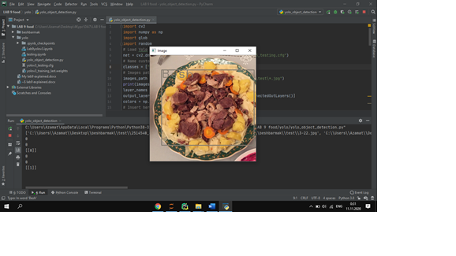

# National-Food
Well, we started collecting our own data. Kazakh national food Beshbarmak was picked as a first object. Google Chrome Extension was used to download about 200 images to train Yolov3 model. You can see the images in dataset.Then, LabelImg used, to label dataset for object detection, and did it to all 200 images: 

